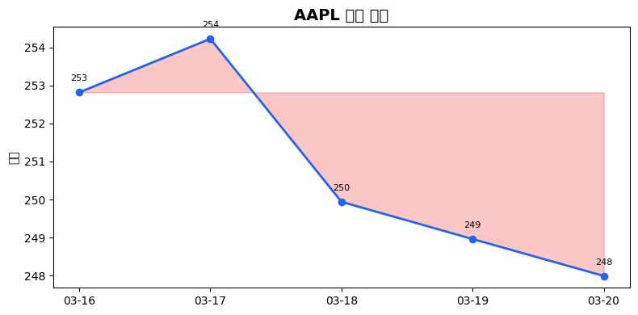
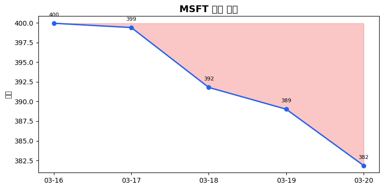
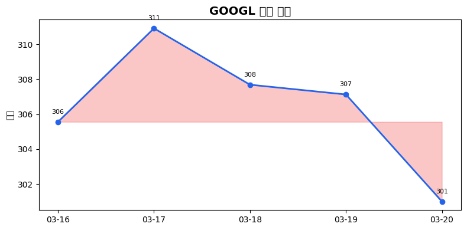
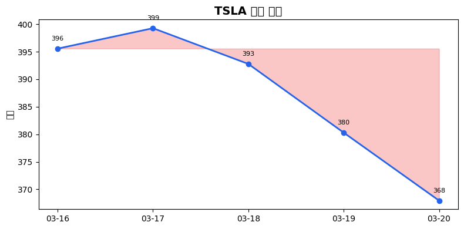
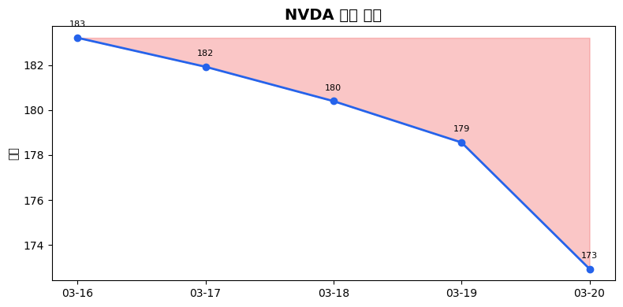
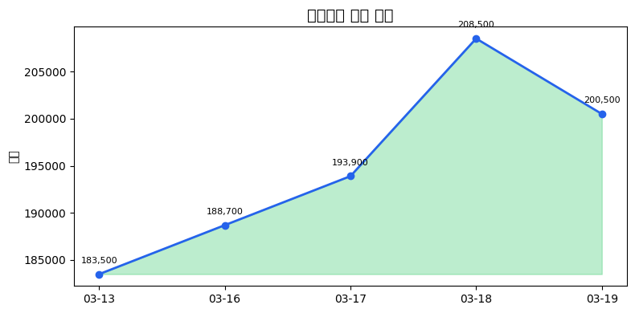
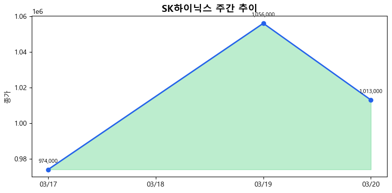
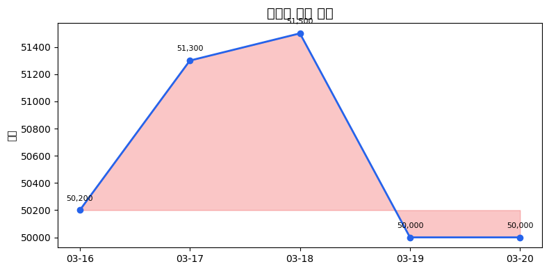

# 일일 주식 리포트 (2026-03-22)

## 📊 요약

- 🇺🇸 미국: 0상승 5하락
- 🇰🇷 한국: 1상승 2하락

## 🇺🇸 미국 주식

### 🔴 AAPL
- 종가: $247.99
- 변동: $-0.97 (-0.39%)

**관련 뉴스:**
- [Investor Reveals $51 Million Sale of Armstrong Strong as Shares Sink Post-Earnings](None)
- [Apple Stock Is Doing Something It Hasn't Done Since 2022. Should You Buy or Run?](None)
- [Coinbase Launches 24/7 Stock Trading For Tesla, Apple, Nvidia With 10X Leverage](None)

### 🔴 MSFT
- 종가: $381.85
- 변동: $-7.17 (-1.84%)

**관련 뉴스:**
- [Atlas Energy Stock Jumps 39% YTD, but One Fund Cut Exposure by $15 Million Last Quarter](None)
- [Prediction: The "Trough of Disillusionment" Will Create the Best Buying Opportunity for Artificial Intelligence (AI) Stocks in 2026](None)
- [Why a Full Exit From Cogent Communications Amid a 74% Stock Drop Could Matter for Investors](None)

### 🔴 GOOGL
- 종가: $301.00
- 변동: $-6.13 (-2.00%)

**관련 뉴스:**
- [Prediction: This Artificial Intelligence (AI) Stock Will Be Worth $5 Trillion by the End of 2026](None)
- [Coinbase Launches 24/7 Stock Trading For Tesla, Apple, Nvidia With 10X Leverage](None)
- [AI Is Rewriting the Old Rules of Google Search and SEO](https://finance.yahoo.com/m/f201e081-8db4-31b4-96da-788ce8e49694/ai-is-rewriting-the-old-rules.html)

### 🔴 TSLA
- 종가: $367.96
- 변동: $-12.34 (-3.24%)

**관련 뉴스:**
- [Dow Jones Futures Fall, Oil Prices Test $100 After Trump Threatens To 'Obliterate' Iran's Power Plants?](https://finance.yahoo.com/m/4b986b69-078c-3b77-948f-5e9fc43f37c2/dow-jones-futures-fall-oil.html)
- [Elon Musk's Terafab bet: what it means for Tesla investors](None)
- [Musk says SpaceX and Tesla to build advanced chip factories in Austin](None)

### 🔴 NVDA
- 종가: $172.93
- 변동: $-5.63 (-3.15%)

**관련 뉴스:**
- [Dow Jones Futures Fall, Oil Prices Test $100 After Trump Threatens To 'Obliterate' Iran's Power Plants?](https://finance.yahoo.com/m/4b986b69-078c-3b77-948f-5e9fc43f37c2/dow-jones-futures-fall-oil.html)
- [Stock Market Crash: The Best Cryptocurrencies to Buy Right Now](None)
- [Oil Is Above $100 a Barrel for the First Time Since 2022. Here's Why Artificial Intelligence (AI) Investors Should Care.](None)

## 🇰🇷 한국 주식

### 🔴 삼성전자 (005930)
- 종가: 199,400.0원
- 변동: -1,100.0원 (-0.55%)

**관련 뉴스:**
- [전쟁 여파에 신용스프레드 확대…금리 급등 ‘긴장’](https://n.news.naver.com/mnews/article/011/0004602177)
- [베이징 찾은 이재용 회장, 中 기업과 반도체·전장 협력 ‘광폭 행보...](https://n.news.naver.com/mnews/article/011/0004602172)
- [오픈AI, 연말까지 직원 4500명→8000명 확충…앤스로픽 추격 대응](https://n.news.naver.com/mnews/article/011/0004602168)

### 🔴 SK하이닉스 (000660)
- 종가: 1,007,000.0원
- 변동: -6,000.0원 (-0.59%)

**관련 뉴스:**
- [전쟁 여파에 신용스프레드 확대…금리 급등 ‘긴장’](https://n.news.naver.com/mnews/article/011/0004602177)
- [슈퍼마이크로 충격, 美반도체주 일제 급락…한국은?](https://n.news.naver.com/mnews/article/421/0008841819)
- [국내선 괜찮다는데…BoA “코스피, 전형적 버블 징후”](https://n.news.naver.com/mnews/article/021/0002778985)

### 🟢 카카오 (035720)
- 종가: 50,000.0원
- 변동: +0.0원 (+0.00%)

**관련 뉴스:**
- [금감원 &quot;올해 銀 새희망홀씨 대출 5.1兆 공급&quot; 적극 지원](https://n.news.naver.com/mnews/article/014/0005495461)
- [AI '총력 투자' 나선 네카오…작년 R&amp;D '조단위' 역대 최대](https://n.news.naver.com/mnews/article/421/0008841797)
- [빅테크 주총 줄줄이…'집중투표제 무력화 꼼수'에 국민연금 제동](https://n.news.naver.com/mnews/article/421/0008841769)
