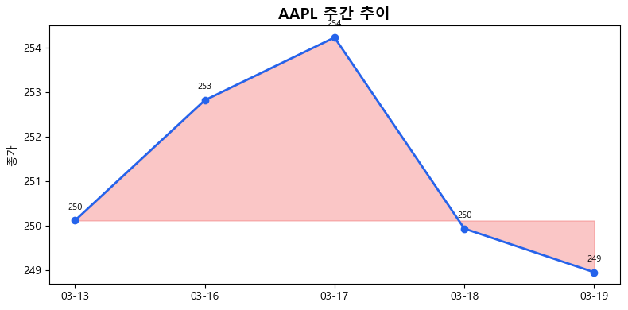
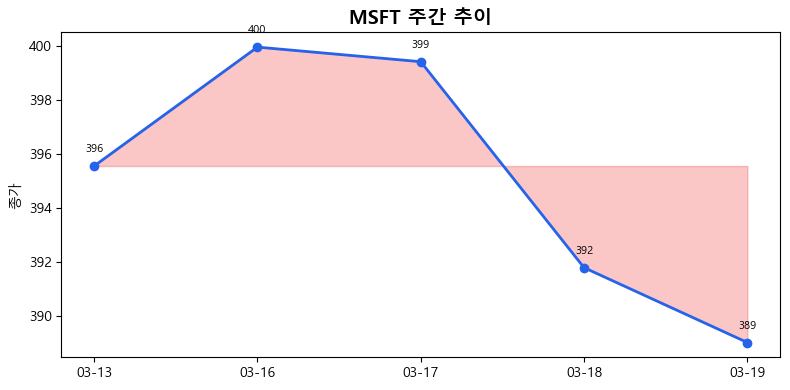
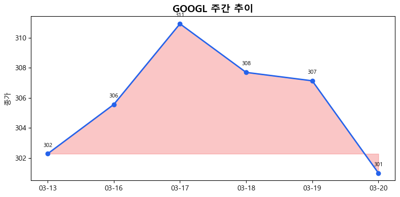
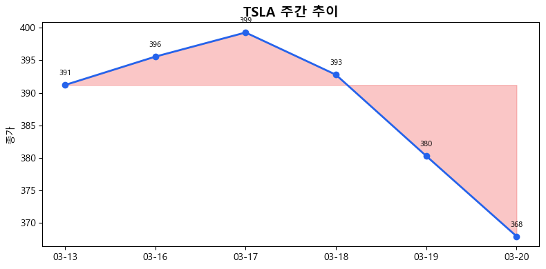
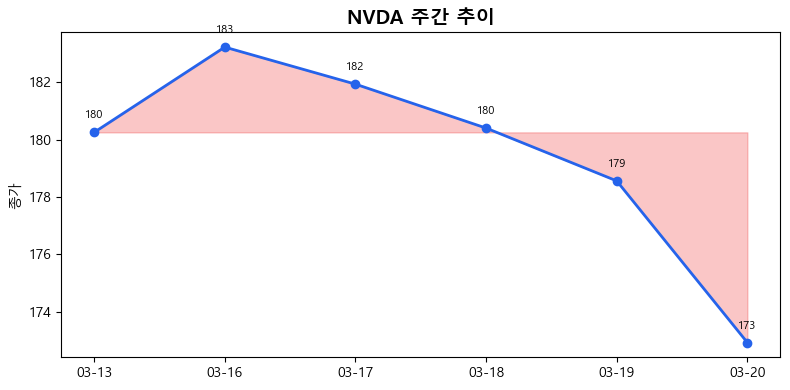
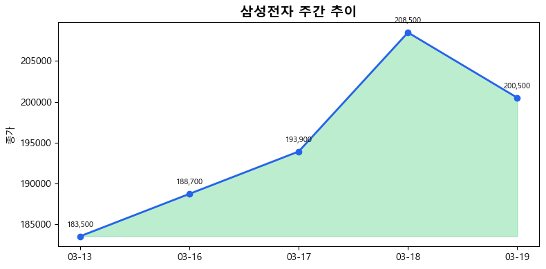
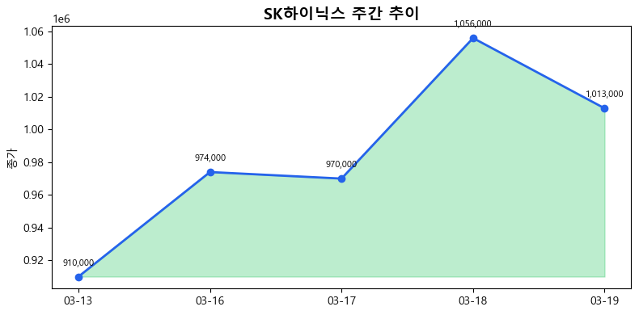
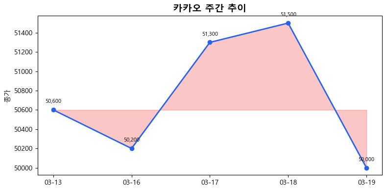

# 일일 주식 리포트 (2026-03-20)

## 📊 요약

- 🇺🇸 미국: 0상승 5하락
- 🇰🇷 한국: 0상승 3하락

## 🇺🇸 미국 주식

### 🔴 AAPL
- 종가: $248.96
- 변동: $-0.98 (-0.39%)

**관련 뉴스:**
- [Market Madness: Why JPMorgan, McDonald's are slam dunk stock picks](None)
- [Prediction: This Neocloud Stock Will Outperform the "Magnificent Seven" in 2026](None)
- [Family Manage LLC Initiates 15.58 Million Position in TCW Flexible Income ETF, According to Recent SEC Filing](None)

### 🔴 MSFT
- 종가: $389.02
- 변동: $-2.77 (-0.71%)

**관련 뉴스:**
- [Tech stocks today: Micron stock falls after blowout earnings report, Nvidia wraps up GTC event](None)
- [Market Madness: Why JPMorgan, McDonald's are slam dunk stock picks](None)
- [How many employees does Salesforce have after 2026 layoffs?](None)

### 🔴 GOOGL
- 종가: $307.13
- 변동: $-0.56 (-0.18%)

**관련 뉴스:**
- [Prediction: This Neocloud Stock Will Outperform the "Magnificent Seven" in 2026](None)
- [Traders Overwhelmed by Iran News Are Turning to AI for Help](None)
- [Planet Labs PBC Q4 Earnings Call Highlights](None)

### 🔴 TSLA
- 종가: $380.30
- 변동: $-12.48 (-3.18%)

**관련 뉴스:**
- [Is the BMW i3 EV's 440 mile range enough to take on Tesla?](None)
- [Exclusive-Tesla in talks with Chinese firms to buy $2.9 billion worth of solar equipment, sources say](None)
- [This Transportation Stock May Outperform the S&P 500 in 2026](None)

### 🔴 NVDA
- 종가: $178.56
- 변동: $-1.84 (-1.02%)

**관련 뉴스:**
- [Uber to invest $1.25B in Rivian in exchange for 50K robotaxis](None)
- [Nvidia's changing its strategic approach to AI, going all in on inferencing and agents](None)
- [Broadcom Stock: Buy, Sell, or Hold?](None)

## 🇰🇷 한국 주식

### 🔴 삼성전자 (005930)
- 종가: 200,500.0원
- 변동: -8,000.0원 (-3.84%)

**관련 뉴스:**
- [불확실성에 속 타는 재계, 그래도 상반기 채용문 활짝 열었다](https://n.news.naver.com/mnews/article/629/0000483431)
- [반도체는 질주, 세트는 감속…삼성 사업부 '명암 뚜렷'](https://n.news.naver.com/mnews/article/119/0003071286)
- [삼성바이오 분할 후 첫 주총…존림 3연임·에피스홀딩스 CFO 이사회 입...](https://n.news.naver.com/mnews/article/366/0001150112)

### 🔴 SK하이닉스 (000660)
- 종가: 1,013,000.0원
- 변동: -43,000.0원 (-4.07%)

**관련 뉴스:**
- [불확실성에 속 타는 재계, 그래도 상반기 채용문 활짝 열었다](https://n.news.naver.com/mnews/article/629/0000483431)
- [엔비디아 매출 1조달러…삼전·하닉·현대차 ‘수혜’](https://n.news.naver.com/mnews/article/016/0002616850)
- [코스피, 개인·기관 ‘사자’에 강보합… 코스닥 1%대 강세](https://n.news.naver.com/mnews/article/366/0001150110)

### 🔴 카카오 (035720)
- 종가: 50,000.0원
- 변동: -1,500.0원 (-2.91%)

**관련 뉴스:**
- [카카오·토스·케이뱅크, ‘이재명 표’ 청년미래적금에 첫 등판](https://n.news.naver.com/mnews/article/366/0001150105)
- [카카오모빌리티, 자율주행 엔지니어 집중 채용…기술 내재화 가속](https://n.news.naver.com/mnews/article/011/0004601522)
- [인뱅 3사, 전산사고 5년간 163건…토뱅·카뱅 64건씩, 케뱅 35건](https://n.news.naver.com/mnews/article/003/0013834529)
